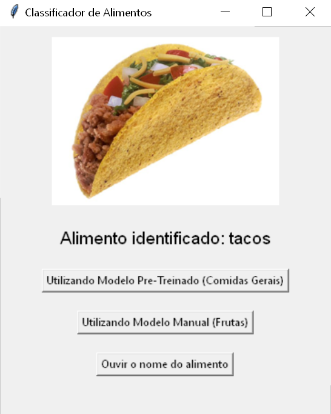

# Classificador de Alimentos

Este projeto é uma aplicação para classificação de alimentos com suporte a duas abordagens diferentes de modelos: um modelo pré-treinado e um modelo treinado manualmente. A interface gráfica permite que o usuário selecione imagens de alimentos, obtenha a classificação e ouça o nome do alimento identificado via TTS (Text-to-Speech).



## Pontos de Operação e Configuração

1. **Interface Gráfica (main.py):**

   - Você pode alterar a lógica de exibição e interação com os modelos.
   - Personalize os botões, mensagens e lógica para incluir novas funcionalidades ou ajustar os fluxos existentes.
2. **Configurações Gerais (constants.py):**

   - Ajuste os caminhos dos arquivos, como o conjunto de dados, modelo salvo e índices das classes.
   - Modifique parâmetros como `IMAGE_SIZE`, `BATCH_SIZE` e `EPOCHS` para personalizar o treinamento e inferência.
3. **Treinamento de IA Personalizada (treinador_de_modelo.py):**

   - Use este arquivo para criar e treinar um novo modelo.
   - Altere a arquitetura do modelo, otimizadores ou os hiperparâmetros para experimentar melhorias na classificação.

## Estrutura do Projeto

### Arquivos Principais

#### **constants.py**

Este módulo contém as configurações e caminhos necessários para o projeto:

- **Constantes:**
  - `IMAGE_SIZE`: Tamanho das imagens utilizadas no modelo (100x100 pixels).
  - `BATCH_SIZE`: Número de imagens processadas por vez durante o treinamento.
  - `EPOCHS`: Número de épocas para o treinamento.
  - `DATASET_PATH`: Caminho relativo para o conjunto de dados.
  - `MODEL_NAME`: Caminho relativo para salvar o modelo treinado.
  - `INDEX_JSON_NAME`: Caminho relativo para o arquivo JSON que contém os índices das classes traduzidas.
- **Funções:**
  - `get_current_directory()`: Obtém o diretório onde o arquivo está localizado, garantindo portabilidade.

#### **modelo_pre_treinado.py**

Este módulo implementa a classe `PreTrainedModel`, que utiliza um modelo pré-treinado para classificar imagens de alimentos:

- **Classes:**
  - `PreTrainedModel`:
    - Inicializa o processador (`AutoImageProcessor`) e o modelo pré-treinado da biblioteca `transformers`.
    - Método `classify_food_image(image_path)`: Processa uma imagem, realiza a previsão da classe e retorna o nome do alimento identificado.
- **Dependências:**
  - `transformers`, `torch`, e `Pillow` para manipulação de imagens e inferência do modelo.

#### **modelo_manual.py**

Este módulo implementa a classe `ManualModel`, que utiliza um modelo treinado manualmente:

- **Classes:**
  - `ManualModel`:
    - Carrega o modelo salvo e os índices das classes traduzidas.
    - Método `classify_food_image(image_path)`: Carrega uma imagem, realiza a previsão utilizando o modelo manual e retorna o nome do alimento identificado.
- **Dependências:**
  - `numpy`, `keras`, e `json` para processamento de imagens e inferência do modelo.

#### **treinador_de_modelo.py**

Este módulo realiza o treinamento de um modelo utilizando a arquitetura MobileNetV2:

- **Etapas:**
  1. Carregamento do conjunto de dados com `ImageDataGenerator`.
  2. Construção de um modelo com camadas personalizadas baseadas no MobileNetV2.
  3. Treinamento do modelo com os dados fornecidos.
  4. Salvamento do modelo treinado e dos índices das classes.
- **Saídas:**
  - Modelo salvo em formato `.h5`.
  - Arquivo JSON contendo os índices das classes traduzidas.

#### **main.py**

Este módulo implementa a interface gráfica (GUI) para o classificador:

- **Classes:**
  - `ClassifyFood`:
    - Integra as funcionalidades dos modelos pré-treinado e manual.
    - Permite seleção de imagens e classificação via interface gráfica.
    - Inclui suporte a TTS para ouvir o nome do alimento identificado.
- **Interface Gráfica:**
  - Criada com `tkinter`.
  - Elementos:
    - `image_label`: Exibe a imagem carregada.
    - `result_label`: Exibe o nome do alimento identificado.
    - Botões:
      - "Utilizando Modelo Pré-Treinado (Comidas Gerais)".
      - "Utilizando Modelo Manual (Frutas)".
      - "Ouvir o nome do alimento" (aparece após a classificação).
- **Dependências:**
  - `tkinter`, `Pillow`, e `pyttsx3`.

## Requisitos

- Python 3.7+
- Bibliotecas:
  - `transformers`
  - `torch`
  - `keras`
  - `numpy`
  - `Pillow`
  - `pyttsx3`

## Como Usar

1. Clone este repositório.
2. Instale as dependências:
   ```bash
   pip install -r requirements.txt
   ```
3. Execute o arquivo `main.py`:
   ```bash
   python main.py
   ```
4. Use a interface gráfica para:
   - Carregar uma imagem.
   - Classificar utilizando os dois modelos disponíveis.
   - Ouvir o nome do alimento identificado.

## Treinamento de Modelo Manual

1. Certifique-se de que o conjunto de dados está no caminho especificado em `constants.py`.
2. Execute o arquivo `treinador_de_modelo.py` para treinar o modelo:
   ```bash
   python treinador_de_modelo.py
   ```
3. O modelo treinado será salvo no caminho especificado em `MODEL_NAME`.

## Contribuições

Contribuições são bem-vindas! Sinta-se à vontade para abrir issues ou pull requests.

---
